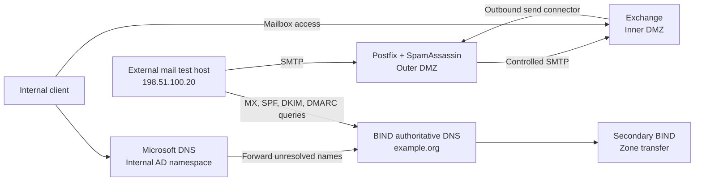

# Email and DNS architecture

> Sanitized reconstruction based on a team laboratory environment in which I served as the primary technical contributor.

All names and addresses below are illustrative. `example.org` is a reserved example domain; `198.51.100.0/24` is an RFC 5737 documentation network.

The arrows represent intended service paths and documented configuration. The private reports do not consistently prove final external-to-internal delivery.
