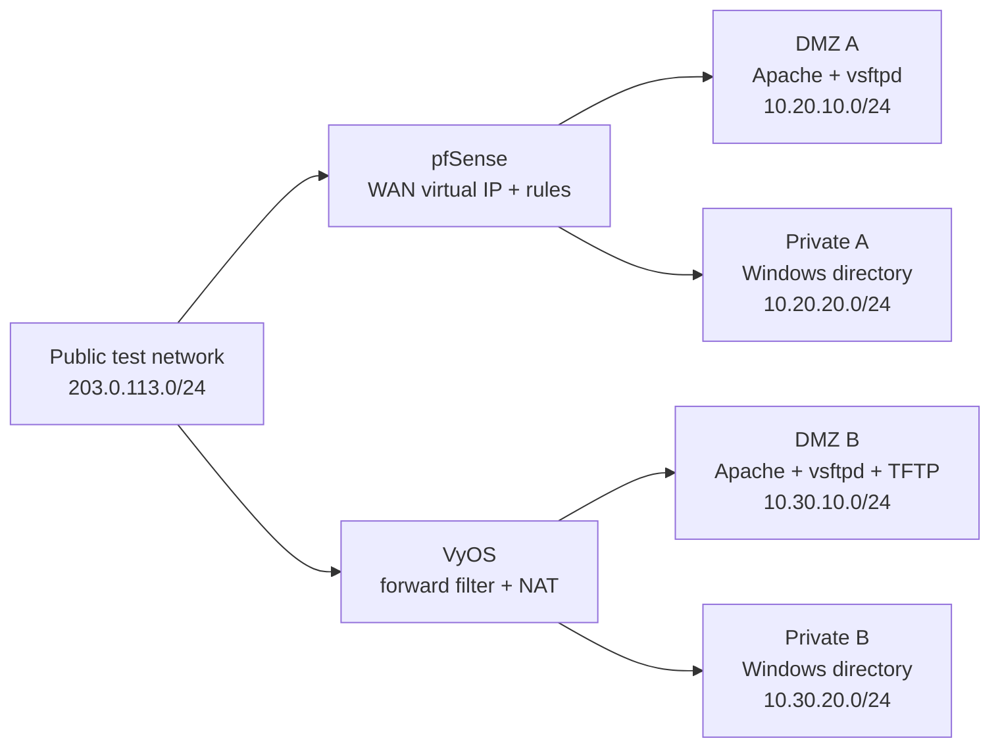

# Firewall and DMZ role diagram

> Sanitized reconstruction based on a collaborative team laboratory environment.

The source report describes two separate lab environments; they are displayed side by side below. All addresses are illustrative RFC 1918 or RFC 5737 examples.

Permitted inbound service traffic terminates in the DMZ. Private networks use outbound source NAT. The drawing does not imply that public clients can reach private directory services.
