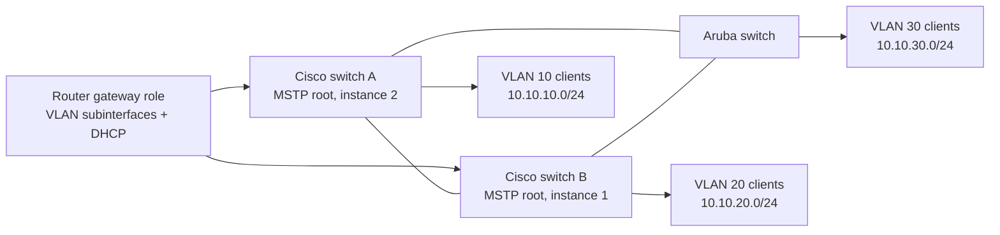
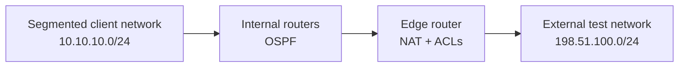

# Routed network diagram

> Sanitized reconstruction based on a team laboratory environment in which I served as the primary technical contributor.

The diagrams separate the redundant switching phase from the later routed-policy phase. Network labels and addresses are illustrative RFC 1918 or RFC 5737 examples; neither drawing is an original wiring record.

MSTP blocks a redundant forwarding path per instance to avoid a Layer 2 loop. Router subinterfaces provide the VLAN gateways in the documented switching phase.

The later phase added dynamic routing, edge translation, and access controls. These are role drawings, not executable configurations.
