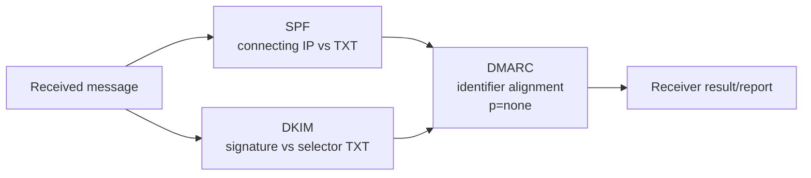
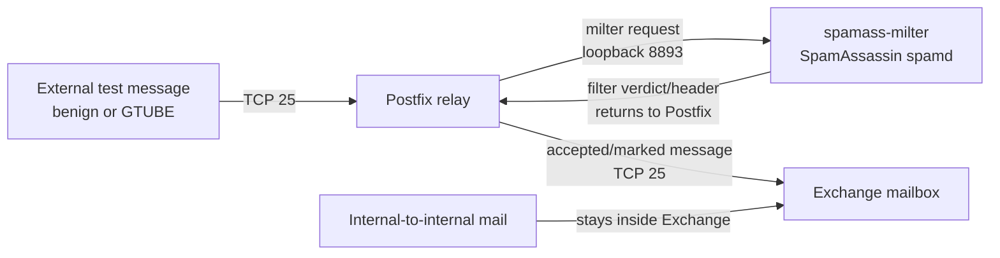

# Authentication and filtering paths

`reconstructed-from-project-records`.

The original failed GTUBE test used the lower path and bypassed the filter. A receiver's DMARC result requires alignment evidence; a published `p=none` TXT value alone is a monitoring policy, not enforcement.
