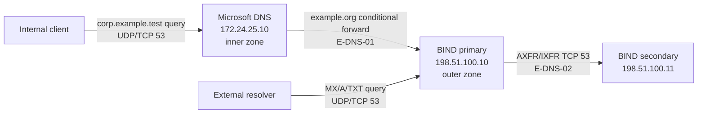
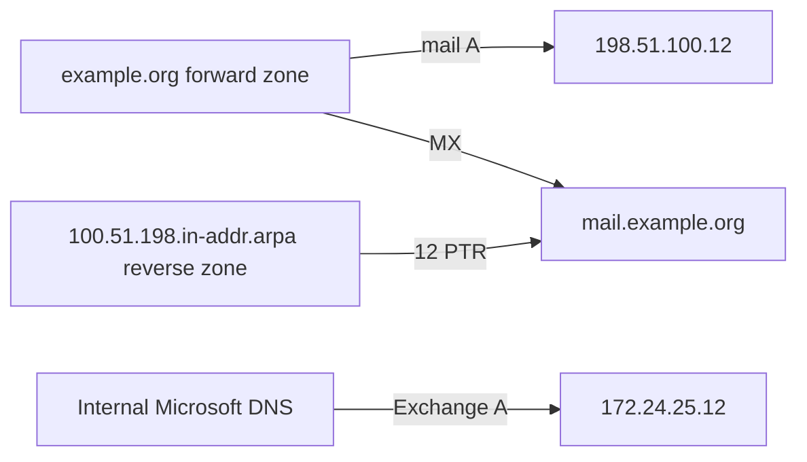

# Internal and public DNS flow

`reconstructed-from-project-records`.

The external zone supplies public service records. The internal zone supplies directory and Exchange names. A host record in the wrong zone or a stale secondary serial can break the next service even if DNS daemons are running.
