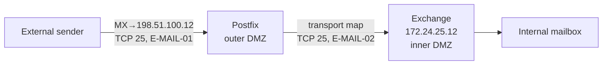
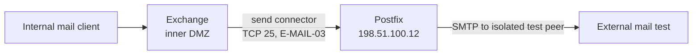

# SMTP relay and Exchange interaction

`reconstructed-from-project-records`.

The Postfix transport map and Exchange connector point in opposite directions. Each requires a separate firewall rule and log check. The records do not include a complete external-delivery trace; see [Project Completion](../README.md#project-completion).
