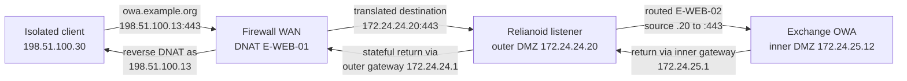

# External HTTPS and OWA publishing

`reconstructed-from-project-records`. The NAT mapping is a reference flow to test in a new lab; the report records the ADC listener/backend and an external-access troubleshooting event but does not provide a complete original pfSense export.

The troubleshooting record found an HTTP/80 farm where an HTTPS/443 OWA listener was intended. Check the public DNS answer, WAN translation, firewall pass rule, ADC listener, backend health, and certificate chain separately. A second web farm cannot share the same VIP and listener port without an appropriate host-routing design; the recorded lab used a distinct HTTPS port.
