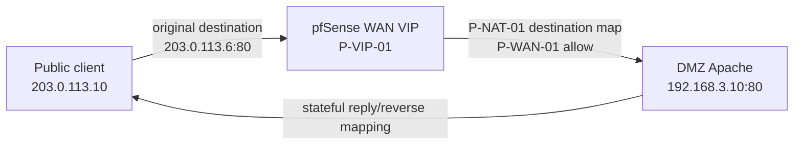
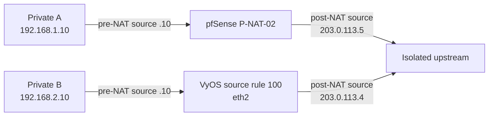

# Inbound and outbound NAT

`reference-implementation` for pfSense target mapping; `reconstructed-from-project-records` for the VyOS source-NAT role.

## Inbound pfSense VIP

## Outbound private-client PAT

Inbound destination mapping and outbound source masquerade solve different routing problems. The report's VyOS DMZ path was routed; no original VyOS destination-NAT command is claimed.
