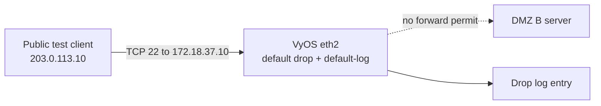
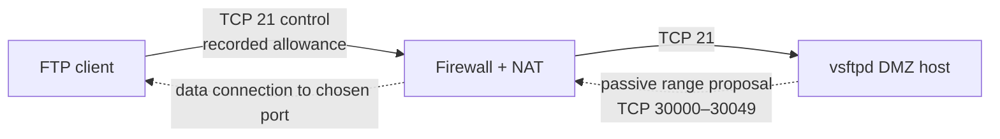

# Denied management and FTP data paths

`reconstructed-from-project-records` for blocked SSH; `reference-implementation` for a proposed passive FTP range.

## Denied SSH

The recorded test first showed a failed SSH connection without a log. Enabling `default-log` produced the drop record. A failed connection without that record would not, by itself, identify the blocking device.

## FTP control and passive data

The passive range is a proposed new-lab configuration in [vsftpd.conf](../configs/vsftpd.conf). The source report documents FTP service access but not this range or a complete passive transfer. Test a directory listing and file download while inspecting both firewall state and server logs.
