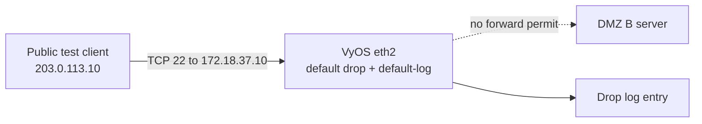
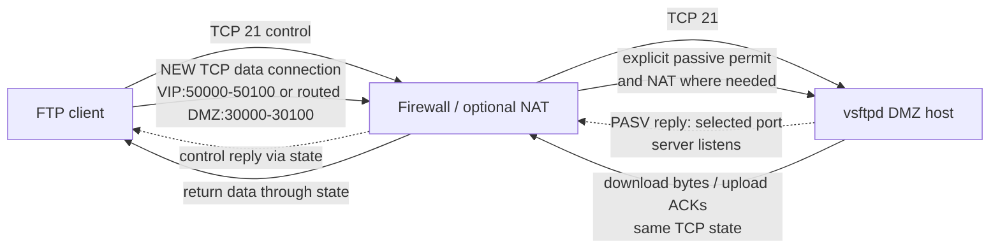

# Denied management and FTP data paths

`reconstructed-from-project-records` for blocked **DMZ server** SSH; `reference-implementation` for bounded management and owner-supplied passive ranges.

## Denied SSH

The recorded test first showed a failed SSH connection without a log. Enabling `default-log` produced the drop record. That test does **not** test router-local management. The VyOS reference separately restricts IPv4 input SSH to `192.168.2.20` on `eth0` and drops other router-local traffic. IPv6 input/forward default-drop is an explicit reference boundary, not historical test evidence.

## FTP control and passive data

The two ranges are reference settings in [pfSense vsftpd](../configs/vsftpd-pfsense.conf) and [VyOS vsftpd](../configs/vsftpd.conf). The report documents FTP service access but does not preserve those ranges or a complete passive transfer trace. Test listing, download, and read-only upload denial while inspecting firewall state and server logs.
