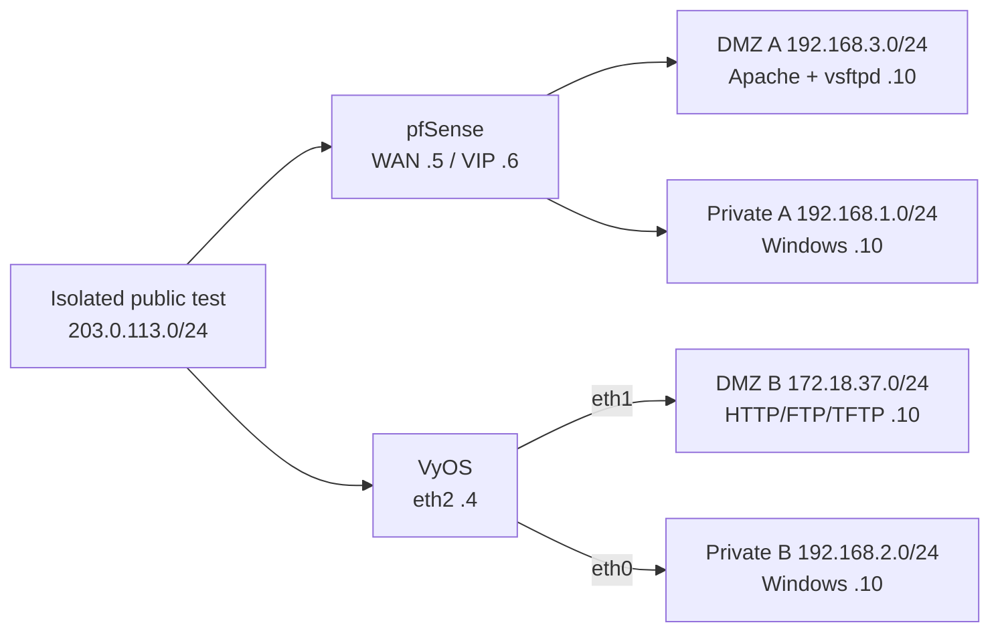
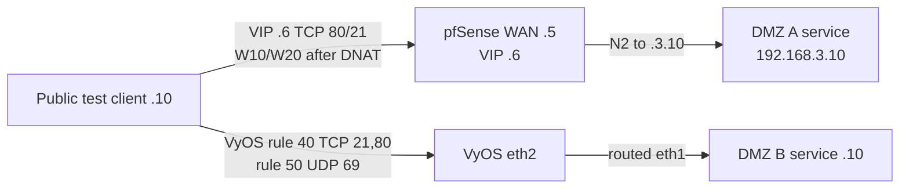

# Zones and allowed paths

`reconstructed-from-project-records`.

VyOS's DMZ path needs the isolated upstream route in the [interface plan](../configs/INTERFACES_AND_ZONES.md); it is not direct Internet routing to RFC 1918 space. pfSense rule IDs are reference-document identifiers, not original device rule numbers.
