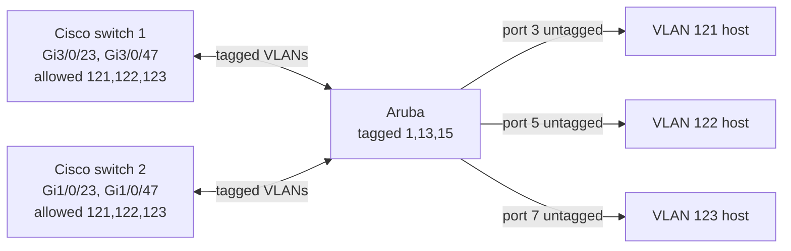
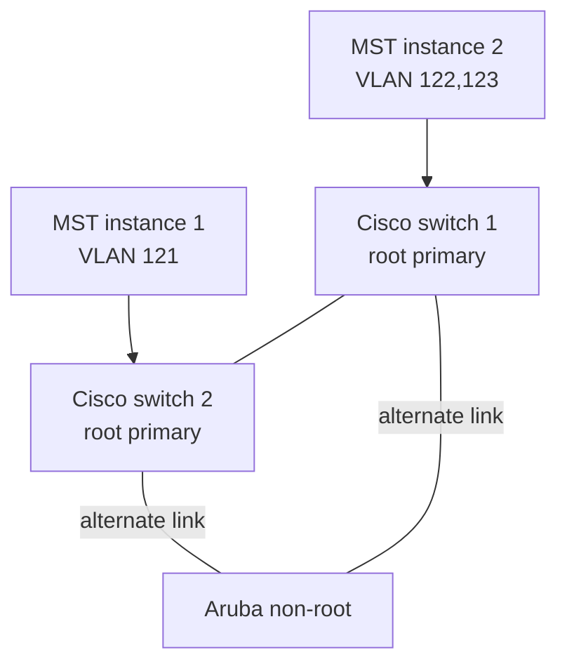

# VLAN ports and MSTP

`reconstructed-from-project-records`.

## Trunk and access placement

## Instance and root selection

MSTP decides which redundant port discards per instance. A particular blocked port depends on bridge IDs and path cost; confirm it with `show spanning-tree mst` rather than assuming this drawing fixes the port role. Region name `portfolio-region`, revision `1`, and mappings must match on every switch. The actual lab used a different region label, replaced here consistently.
