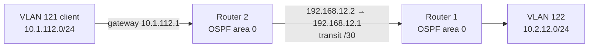
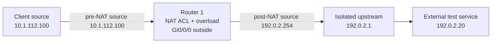

# Routed path and NAT boundary

`reconstructed-from-project-records`. These diagrams represent the later OSPF phase, separate from the MSTP-phase router placement.

## Inter-router traffic

## Outbound NAT

`192.0.2.0/24` is a documentation network. It illustrates the translation boundary; use a real isolated uplink in a recreation. Verify both the OSPF route and a NAT translation entry before interpreting a failed application request as an ACL issue.
