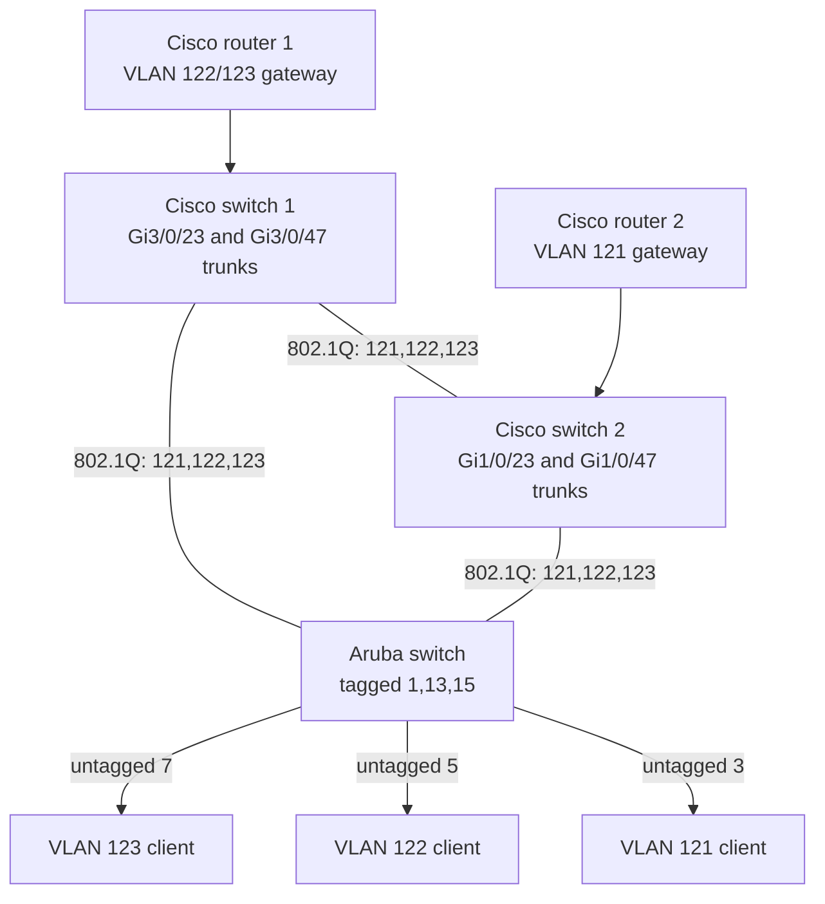
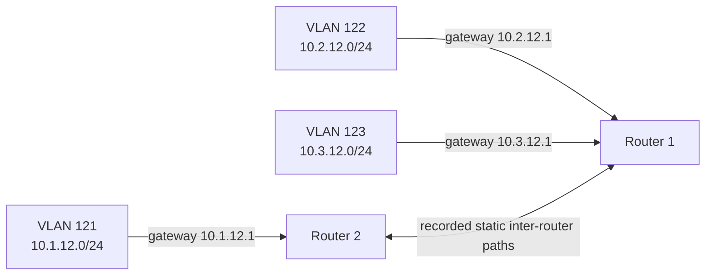

# Physical and logical topology

`reconstructed-from-project-records`. The first diagram represents the three-switch MSTP phase. Port labels identify recorded trunk ports, but the exact cable endpoint for each port should be confirmed on actual equipment.

The logical view shows VLANs as separate broadcast domains even though they share trunk cables.

